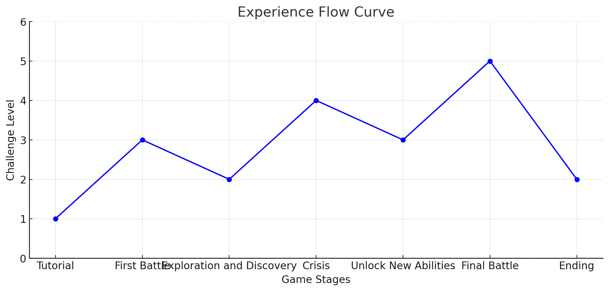

# Star Dog's Adventure

## 介绍

《星际小狗的冒险》是一款富有活力的游戏，玩家将陪着主角小狗体验夏日冒险。游戏包括与名人Lucy的粉丝店挑战和音乐海盗店的刺激战斗。

## 特性

### 与Lucy的冒险：粉丝店挑战

### 粉丝店挑战  
1. **数字华容道解谜小游戏**  
   - 体验：逻辑和策略  
   - 说明：玩家通过移动数字块，将其排列成特定的顺序，来证明对Lucy的忠诚和智慧。
   - 奖励：增加Lucy的影响力，解锁下一级挑战  
   - 潜在威胁：海盗出现，重置进度或增加复杂性
 
2. **合作完成拼图**
      - 体验：专注与合作  
      - 奖励：增加Lucy的影响力，解锁新内容  
      - 潜在威胁：海盗搅乱拼图进度  
3. **发现喜好对子** 
      - 体验：记忆与了解  
      - 奖励：更好地了解Lucy，增加影响力  
      - 潜在威胁：海盗混淆记忆

### 音乐海盗店挑战

1. **战斗与防御小游戏** - 激动人心的战斗场景，保护Lucy的声誉。
   - 奖励：获得战利品
   - 潜在威胁：战败，损失影响力

2. **海盗侦查小游戏** - 通过潜行和侦查提前预警海盗威胁。
   - 奖励：减少海盗威胁
   - 潜在威胁：被发现，增加海盗活动

### 小狗的日常冒险

- **规划新一天**：设置目标，解锁新挑战
- **前往商店选择**：解锁新商店，获取特殊优惠
- **Lucy的特殊事件**：深入参与，解锁特殊奖励
- **回家与家庭互动**：加深家庭关系，解锁家庭故事
- **夜间决策**：制定明智计划，解锁新机会
- **保存进度，进入下一天**：总结成就，准备新的一天

### 玩家体验流设计demo版本

### 未来扩展

购物体验计划在未来版本中丰富更多内容。期待更多商店、角色和冒险！

## 入门指南

请参阅[文档](link-to-documentation)以获取安装说明和游戏玩法详细信息。

## 贡献

欢迎贡献！随时提交问题和拉取请求。

## 许可证

本项目在[MIT许可证](link-to-license)下获得许可。

## 联系方式

有关更多信息，请联系[wyfaxyj@gmail.com](wyfaxyj@gmail.com)。
